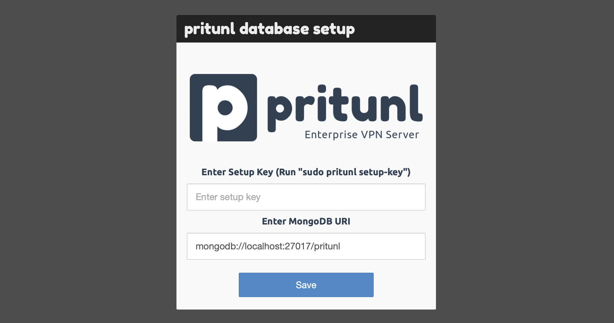

# AWS VPN (Pritunl) Terraform Module

Terraform module with create instance with Pritunl VPN on AWS.

## Usage

```terraform
resource "aws_key_pair" "maintainer" {
  key_name   = "example-key"
  public_key = "ssh-rsa AAAAXXX"
}

module "vpn" {
  source = "git@github.com:<repository_name>/terraform-aws-pritunl-vpn.git?ref=v0.0.0"
  prefix      = "example"
  environment = "dev"
  vpc_id      = "vpc-xxx"
  subnet_id   = "subnet-xxx"
  key_name    = aws_key_pair.maintainer.key_name
  tags = {
    workspace = "900-test"
  }
}
```

## HOW TO SET UP PRITUNL-VPN

### GET SETUP KEY AND USERNAME PASSWORD

```shell
  ssh ec2-user@<vpn-public-ip> #(optional) -i <private_key_path>
  sudo pritunl setup-key # save for fill in ui (only first setup)
  sudo pritunl default-password # save for first login
```

### Fill Setup Key, User from previous step




### Create organization

- click on "Users" in nav bar
- click on "Add Organization"


### Create Server

- click on "Servers" in nav bar
- Click on "Add Server" Button

- Config Server
  - **name**: anything
  - **port**: default must be 12383 (must be match with ingress policy)
  - **DNS Server**: Default 8.8.8.8
  - **Virtual Network**: Leave Default (CIDR must be avalible)


### Attach Origanization to Server

- Click on "Attach Organization" Button


### Start VPN Server

- Click on "Start Server" Button


- Done


## Add User To Access VPN

### Create User

- Click on Users in NavBar
- Clicl on "Add User" Button


### Config User

- Config User
  - **Name**: anything
  - **Pin**: password to access VPN


### Download VPN File


<!-- BEGIN_TF_DOCS -->
## Requirements

| Name | Version |
|------|---------|
| <a name="requirement_terraform"></a> [terraform](#requirement\_terraform) | >= 1.0 |
| <a name="requirement_aws"></a> [aws](#requirement\_aws) | >= 3.0 |

## Providers

| Name | Version |
|------|---------|
| <a name="provider_aws"></a> [aws](#provider\_aws) | 4.11.0 |

## Modules

| Name | Source | Version |
|------|--------|---------|
| <a name="module_ec2"></a> [ec2](#module\_ec2) | git::ssh://git@github.com/oozou/terraform-aws-ec2-instance.git | v1.0.2 |

## Resources

| Name | Type |
|------|------|
| [aws_ami.amazon_linux](https://registry.terraform.io/providers/hashicorp/aws/latest/docs/data-sources/ami) | data source |

## Inputs

| Name | Description | Type | Default | Required |
|------|-------------|------|---------|:--------:|
| <a name="input_additional_sg_attacment_ids"></a> [additional\_sg\_attacment\_ids](#input\_additional\_sg\_attacment\_ids) | (Optional) The ID of the security group. | `list(string)` | `[]` | no |
| <a name="input_environment"></a> [environment](#input\_environment) | Environment Variable used as a prefix | `string` | n/a | yes |
| <a name="input_instance_type"></a> [instance\_type](#input\_instance\_type) | (Optional) The instance type to use for the instance. Updates to this field will trigger a stop/start of the EC2 instance. | `string` | `"t2.medium"` | no |
| <a name="input_key_name"></a> [key\_name](#input\_key\_name) | Key name of the Key Pair to use for the vpn instance; which can be managed using | `string` | n/a | yes |
| <a name="input_prefix"></a> [prefix](#input\_prefix) | The prefix name of customer to be displayed in AWS console and resource | `string` | n/a | yes |
| <a name="input_security_group_ingress_rules"></a> [security\_group\_ingress\_rules](#input\_security\_group\_ingress\_rules) | Map of ingress and any specific/overriding attributes to be created | `any` | <pre>{<br>  "allow_to_config_vpn": {<br>    "cidr_blocks": [<br>      "0.0.0.0/0"<br>    ],<br>    "port": "443"<br>  },<br>  "allow_to_connect_vpn": {<br>    "cidr_blocks": [<br>      "0.0.0.0/0"<br>    ],<br>    "port": "12383",<br>    "protocol": "udp"<br>  },<br>  "allow_to_ssh": {<br>    "cidr_blocks": [<br>      "0.0.0.0/0"<br>    ],<br>    "port": "22"<br>  }<br>}</pre> | no |
| <a name="input_subnet_id"></a> [subnet\_id](#input\_subnet\_id) | The ID of the subnet to deploy vpn relate to VPC | `string` | n/a | yes |
| <a name="input_tags"></a> [tags](#input\_tags) | Tags to add more; default tags contian {terraform=true, environment=var.environment} | `map(string)` | `{}` | no |
| <a name="input_vpc_id"></a> [vpc\_id](#input\_vpc\_id) | The ID of the VPC | `string` | n/a | yes |

## Outputs

| Name | Description |
|------|-------------|
| <a name="output_public_ip"></a> [public\_ip](#output\_public\_ip) | public ip for access vpn server |
<!-- END_TF_DOCS -->
