# AWS VPN (Pritunl) Terraform Module

Terraform module with create instance with Pritunl VPN on AWS.

## Usage

```terraform
module "vpn" {
  source = "git@github.com:<repository_name>/terraform-aws-pritunl-vpn.git?ref=v0.0.0"
  prefix      = "example"
  environment = "dev"
  vpc_id      = "vpc-xxx"
  subnet_id   = "subnet-xxx"
  key_name    = aws_key_pair.maintainer.key_name
  tags = {
    workspace = "900-test"
  }
}
```

## HOW TO SET UP PRITUNL-VPN

### GO TO SSM CONSOLE FOR SESSION MANAGER

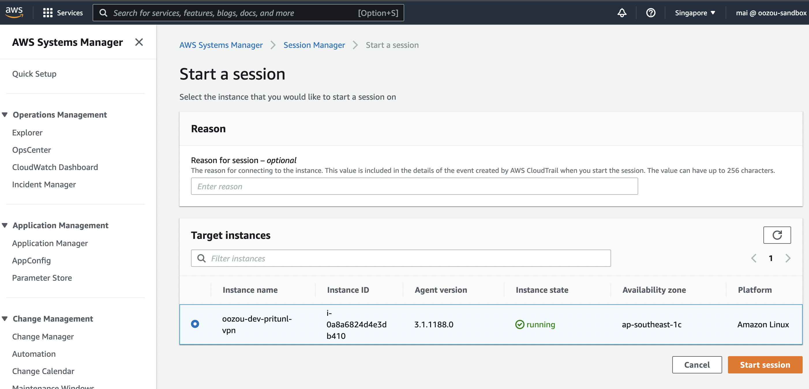

### GET Default Password

```shell
  sudo pritunl default-password # save for first login
```

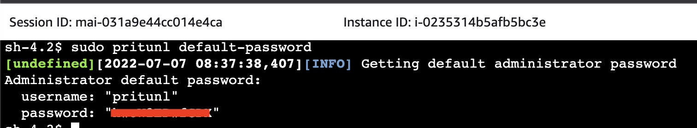

### Login

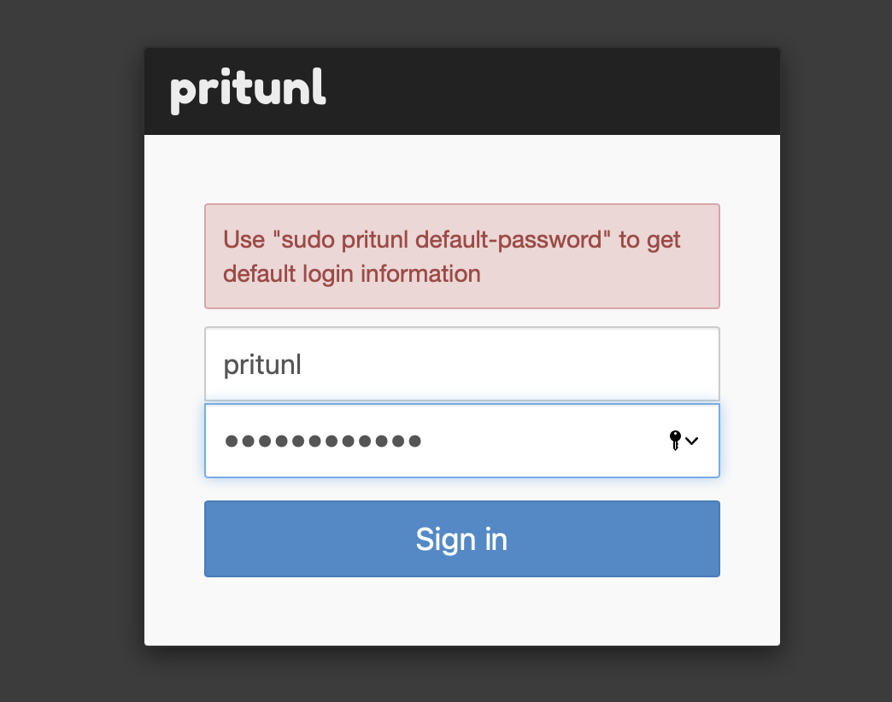

### Server Setting

#### Require

- **Public Address** : Set to `Public DNS name` or `Public Loadbalancer`  for VPN Client ACCESS

#### Optional

- **Username** : New Username for Connect to VPN server
- **New Password** : New Password For For Connect to VPN server

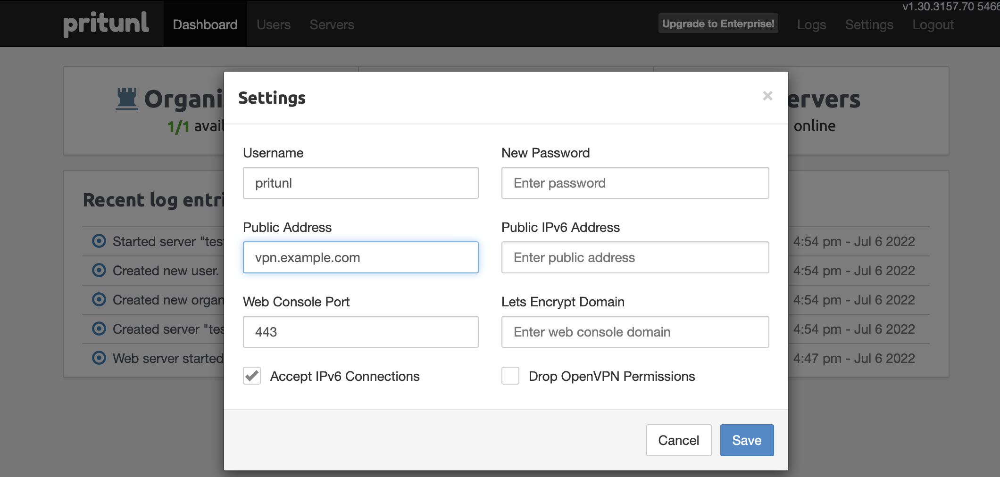

### Create organization

- click on "Users" in nav bar
- click on "Add Organization"

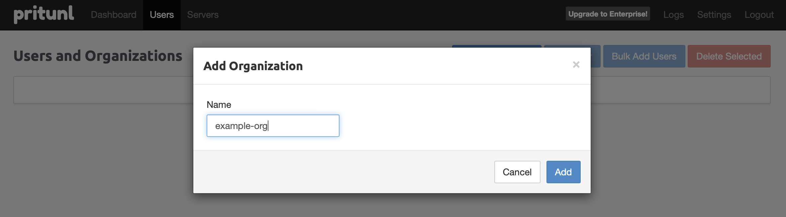

### Create Server

- click on "Servers" in nav bar
- Click on "Add Server" Button

- Config Server
  - **name**: anything
  - **port**: default must be 12383 (must be match with ingress policy)
  - **DNS Server**: Default 8.8.8.8
  - **Virtual Network**: Leave Default (CIDR must be avalible)

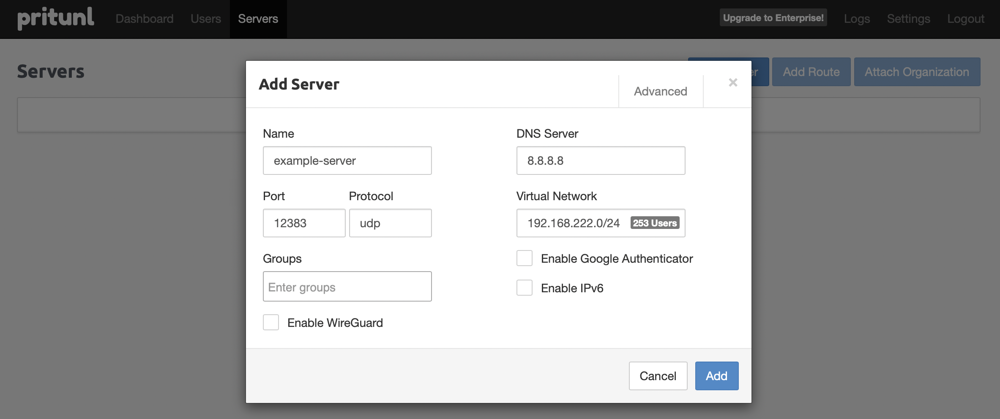

### Attach Origanization to Server

- Click on "Attach Organization" Button
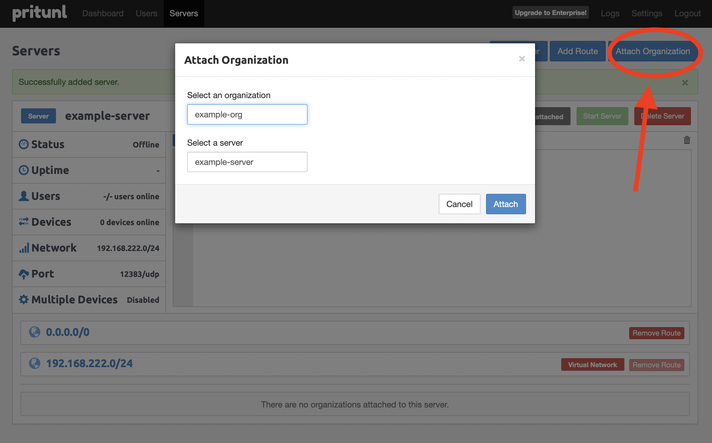

### Start VPN Server

- Click on "Start Server" Button
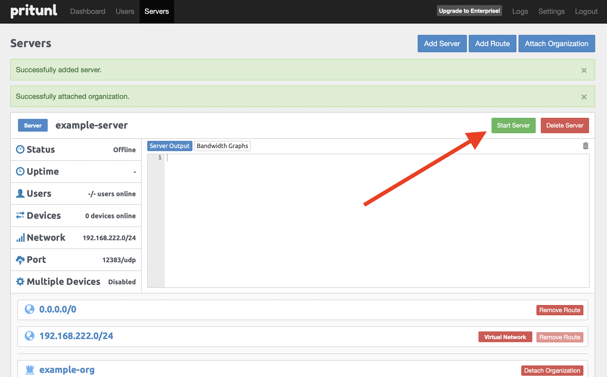

- Done
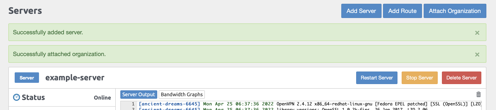

## Add User To Access VPN

### Create User

- Click on Users in NavBar
- Clicl on "Add User" Button
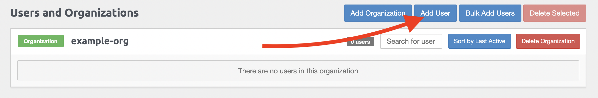

### Config User

- Config User
  - **Name**: anything
  - **Pin**: password to access VPN

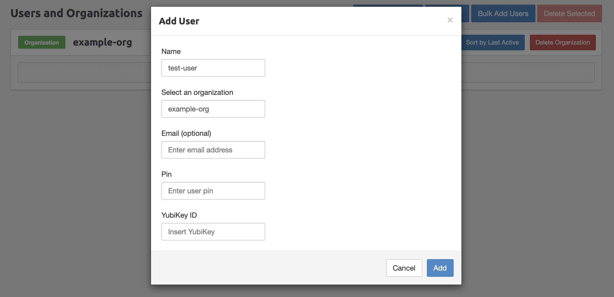

### Download VPN File

## Set VPN Server to Private

```terraform
module "pritunl_vpn" {
  . . .
  is_enabled_https_public = false
}
```

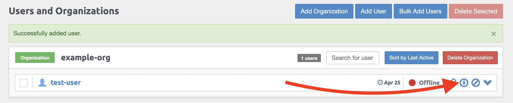


<!-- BEGIN_TF_DOCS -->
## Requirements

| Name | Version |
|------|---------|
| <a name="requirement_terraform"></a> [terraform](#requirement\_terraform) | >= 1.0 |
| <a name="requirement_aws"></a> [aws](#requirement\_aws) | >= 3.0 |

## Providers

| Name | Version |
|------|---------|
| <a name="provider_aws"></a> [aws](#provider\_aws) | 4.11.0 |

## Modules

| Name | Source | Version |
|------|--------|---------|
| <a name="module_efs"></a> [efs](#module\_efs) | git::ssh://git@github.com/oozou/terraform-aws-efs.git | feat/support-ip-mount |
| <a name="module_launch_template"></a> [launch\_template](#module\_launch\_template) | git::ssh://git@github.com/oozou/terraform-aws-launch-template.git | v1.0.2 |

## Resources

| Name | Type |
|------|------|
| [aws_autoscaling_group.this](https://registry.terraform.io/providers/hashicorp/aws/latest/docs/resources/autoscaling_group) | resource |
| [aws_autoscaling_policy.this](https://registry.terraform.io/providers/hashicorp/aws/latest/docs/resources/autoscaling_policy) | resource |
| [aws_iam_instance_profile.this](https://registry.terraform.io/providers/hashicorp/aws/latest/docs/resources/iam_instance_profile) | resource |
| [aws_iam_role.this](https://registry.terraform.io/providers/hashicorp/aws/latest/docs/resources/iam_role) | resource |
| [aws_iam_role_policy.this](https://registry.terraform.io/providers/hashicorp/aws/latest/docs/resources/iam_role_policy) | resource |
| [aws_iam_role_policy_attachment.this](https://registry.terraform.io/providers/hashicorp/aws/latest/docs/resources/iam_role_policy_attachment) | resource |
| [aws_lb.private](https://registry.terraform.io/providers/hashicorp/aws/latest/docs/resources/lb) | resource |
| [aws_lb.public](https://registry.terraform.io/providers/hashicorp/aws/latest/docs/resources/lb) | resource |
| [aws_lb_listener.private](https://registry.terraform.io/providers/hashicorp/aws/latest/docs/resources/lb_listener) | resource |
| [aws_lb_listener.public](https://registry.terraform.io/providers/hashicorp/aws/latest/docs/resources/lb_listener) | resource |
| [aws_lb_target_group.private](https://registry.terraform.io/providers/hashicorp/aws/latest/docs/resources/lb_target_group) | resource |
| [aws_lb_target_group.public](https://registry.terraform.io/providers/hashicorp/aws/latest/docs/resources/lb_target_group) | resource |
| [aws_route53_record.private](https://registry.terraform.io/providers/hashicorp/aws/latest/docs/resources/route53_record) | resource |
| [aws_route53_record.public](https://registry.terraform.io/providers/hashicorp/aws/latest/docs/resources/route53_record) | resource |
| [aws_security_group.this](https://registry.terraform.io/providers/hashicorp/aws/latest/docs/resources/security_group) | resource |
| [aws_security_group_rule.ingress](https://registry.terraform.io/providers/hashicorp/aws/latest/docs/resources/security_group_rule) | resource |
| [aws_ami.amazon_linux](https://registry.terraform.io/providers/hashicorp/aws/latest/docs/data-sources/ami) | data source |
| [aws_iam_policy_document.this](https://registry.terraform.io/providers/hashicorp/aws/latest/docs/data-sources/iam_policy_document) | data source |
| [aws_iam_policy_document.this_assume_role](https://registry.terraform.io/providers/hashicorp/aws/latest/docs/data-sources/iam_policy_document) | data source |
| [aws_route53_zone.this](https://registry.terraform.io/providers/hashicorp/aws/latest/docs/data-sources/route53_zone) | data source |
| [aws_vpc.this](https://registry.terraform.io/providers/hashicorp/aws/latest/docs/data-sources/vpc) | data source |

## Inputs

| Name | Description | Type | Default | Required |
|------|-------------|------|---------|:--------:|
| <a name="input_additional_sg_attacment_ids"></a> [additional\_sg\_attacment\_ids](#input\_additional\_sg\_attacment\_ids) | (Optional) The ID of the security group. | `list(string)` | `[]` | no |
| <a name="input_ami"></a> [ami](#input\_ami) | (Optional) AMI to use for the instance. Required unless launch\_template is specified and the Launch Template specifes an AMI. If an AMI is specified in the Launch Template, setting ami will override the AMI specified in the Launch Template | `string` | `""` | no |
| <a name="input_custom_https_allow_cidr"></a> [custom\_https\_allow\_cidr](#input\_custom\_https\_allow\_cidr) | cidr block for config pritunl vpn | `list(string)` | `null` | no |
| <a name="input_environment"></a> [environment](#input\_environment) | Environment Variable used as a prefix | `string` | n/a | yes |
| <a name="input_instance_type"></a> [instance\_type](#input\_instance\_type) | (Optional) The instance type to use for the instance. Updates to this field will trigger a stop/start of the EC2 instance. | `string` | `"t2.medium"` | no |
| <a name="input_is_create_route53_reccord"></a> [is\_create\_route53\_reccord](#input\_is\_create\_route53\_reccord) | if true will create route53 reccord for vpn, vpn console | `bool` | `false` | no |
| <a name="input_is_create_security_group"></a> [is\_create\_security\_group](#input\_is\_create\_security\_group) | Flag to toggle security group creation | `bool` | `true` | no |
| <a name="input_is_enabled_https_public"></a> [is\_enabled\_https\_public](#input\_is\_enabled\_https\_public) | if true will enable https to public loadbalancer else enable to private loadbalancer | `bool` | `true` | no |
| <a name="input_key_name"></a> [key\_name](#input\_key\_name) | Key name of the Key Pair to use for the vpn instance; which can be managed using | `string` | `null` | no |
| <a name="input_prefix"></a> [prefix](#input\_prefix) | The prefix name of customer to be displayed in AWS console and resource | `string` | n/a | yes |
| <a name="input_private_lb_vpn_domain"></a> [private\_lb\_vpn\_domain](#input\_private\_lb\_vpn\_domain) | domain of vpn console output will be <var.vpn\_domain>.<var.route53\_zone\_name> | `string` | `"vpn-console"` | no |
| <a name="input_private_rule"></a> [private\_rule](#input\_private\_rule) | private rule for run connect vpn | <pre>list(object({<br>    port     = number<br>    protocol = string<br>  }))</pre> | `[]` | no |
| <a name="input_private_subnet_ids"></a> [private\_subnet\_ids](#input\_private\_subnet\_ids) | The List of the private subnet ID to deploy private lb for vpn relate to VPC | `list(string)` | n/a | yes |
| <a name="input_public_lb_vpn_domain"></a> [public\_lb\_vpn\_domain](#input\_public\_lb\_vpn\_domain) | domain of vpn output will be <var.vpn\_domain>.<var.route53\_zone\_name> | `string` | `"vpn"` | no |
| <a name="input_public_rule"></a> [public\_rule](#input\_public\_rule) | public rule for run connect vpn | <pre>list(object({<br>    port     = number<br>    protocol = string<br>  }))</pre> | <pre>[<br>  {<br>    "port": 12383,<br>    "protocol": "UDP"<br>  }<br>]</pre> | no |
| <a name="input_public_subnet_ids"></a> [public\_subnet\_ids](#input\_public\_subnet\_ids) | The List of the subnet ID to deploy vpn relate to VPC | `list(string)` | n/a | yes |
| <a name="input_route53_zone_name"></a> [route53\_zone\_name](#input\_route53\_zone\_name) | This is the name of the hosted zone | `string` | `""` | no |
| <a name="input_security_group_ingress_rules"></a> [security\_group\_ingress\_rules](#input\_security\_group\_ingress\_rules) | Map of ingress and any specific/overriding attributes to be created | `any` | <pre>{<br>  "allow_to_config_vpn": {<br>    "cidr_blocks": [<br>      "0.0.0.0/0"<br>    ],<br>    "port": "443"<br>  },<br>  "allow_to_connect_vpn": {<br>    "cidr_blocks": [<br>      "0.0.0.0/0"<br>    ],<br>    "port": "12383",<br>    "protocol": "udp"<br>  },<br>  "allow_to_ssh": {<br>    "cidr_blocks": [<br>      "0.0.0.0/0"<br>    ],<br>    "port": "22"<br>  }<br>}</pre> | no |
| <a name="input_tags"></a> [tags](#input\_tags) | Tags to add more; default tags contian {terraform=true, environment=var.environment} | `map(string)` | `{}` | no |
| <a name="input_vpc_id"></a> [vpc\_id](#input\_vpc\_id) | The ID of the VPC | `string` | n/a | yes |

## Outputs

| Name | Description |
|------|-------------|
| <a name="output_dns_name"></a> [dns\_name](#output\_dns\_name) | The DNS name for the filesystem |
| <a name="output_efs_id"></a> [efs\_id](#output\_efs\_id) | The ID that identifies the file system for pritunl vpn |
| <a name="output_lb_private_dns"></a> [lb\_private\_dns](#output\_lb\_private\_dns) | The DNS name of the private load balancer. |
| <a name="output_lb_public_dns"></a> [lb\_public\_dns](#output\_lb\_public\_dns) | The DNS name of the public load balancer. |
<!-- END_TF_DOCS -->
